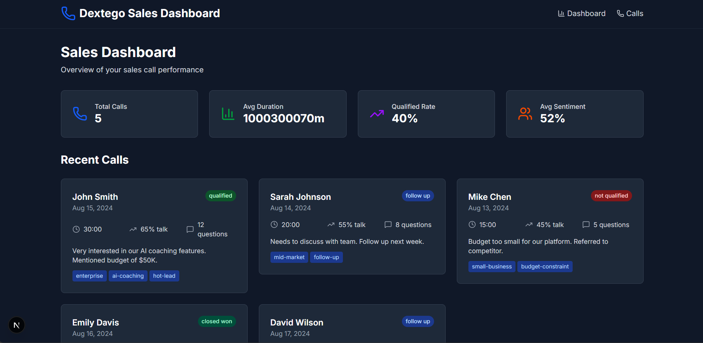
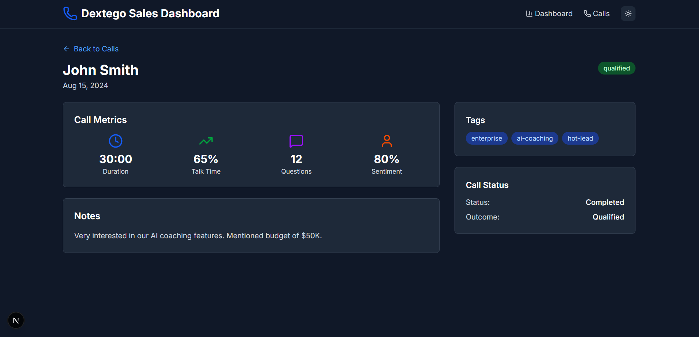
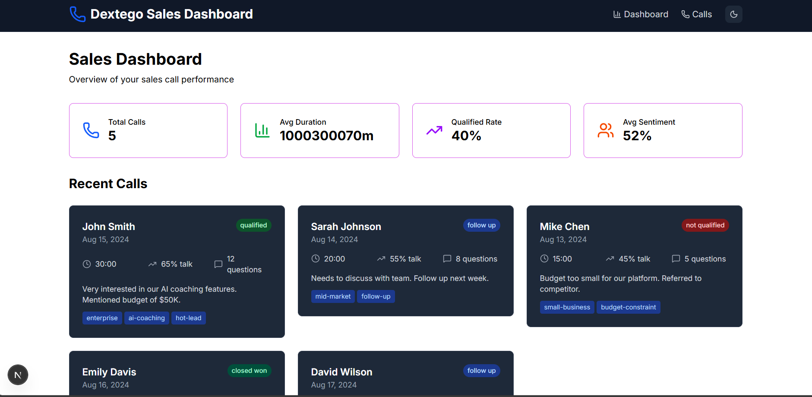
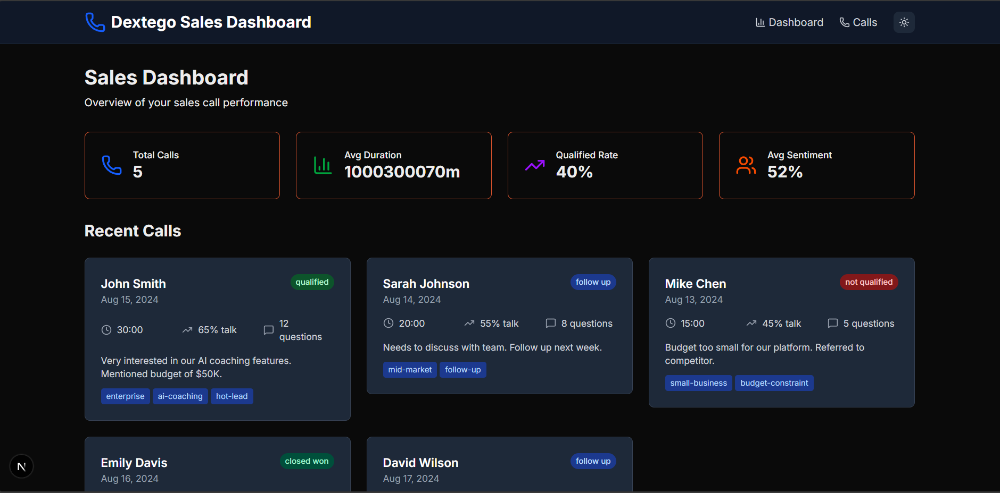
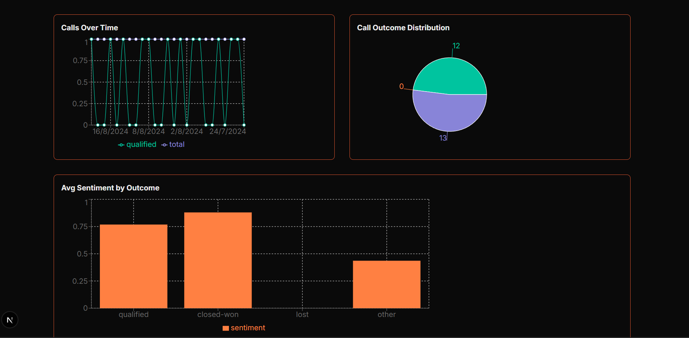
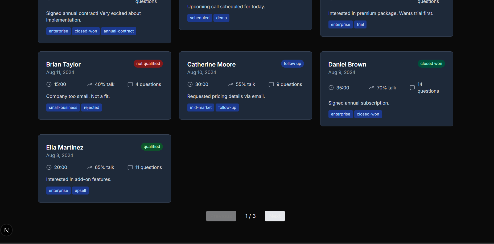
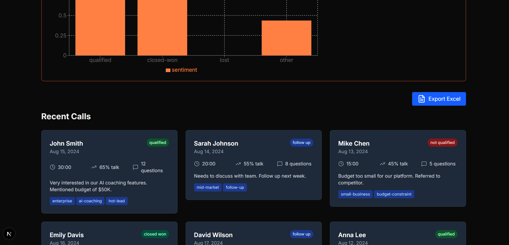

# 📊 Dextego Sales Dashboard - Intern Assignment

## 🐛 Issues Found & How I Fixed Them

### 1. **Missing Dependencies**
**Problem:** Build failed due to missing packages
```bash
❌ Module not found: Can't resolve 'clsx'
❌ Module not found: Can't resolve 'lucide-react'
```

**✅ Solution:**
1. Installed the missing `clsx` package
2. Installed the missing `lucide-react` package

---

### 2. **Invalid JSON Data Structure**
**Problem:** The `data/calls.json` file had multiple JSON syntax errors

**✅ Solution:** Made the following changes in `./data/calls.json` file:
1. Added comma after "notes" in call_002
2. Added comma after "id": "call_003"  
3. Changed "duration" in call_003 to a number (was a string)
4. Removed the extra trailing comma in `"tags": ["small-business", "budget-constraint",]`
5. Added a comma between call_004 and call_005

---

### 3. **API Routes Structure**
**Problem:** API routes needed proper structure for data handling

**✅ Solution:** Made the API/calls structure as below:
- `GET /api/calls` → returns all calls
- `POST /api/calls` → later, you can extend it to add a new call  
- `GET /api/calls/[id]` → returns a single call by ID

---

## 📸 Issues Resolved - Working Application




---

## ✨ Features I Added

### 🌓 **Theme Toggle System**
- Light/Dark mode switching
- Smooth transitions between themes
- Persistent theme preference




---

### 📊 **Data Visualization Charts**
- **Pie Chart:** Call outcomes distribution
- **Bar Chart:** Call duration analysis
- **Area Chart:** Daily call trends
- **Line Chart:** Customer sentiment tracking



---

### 📄 **Pagination & Data Management**
- Display 10 calls per page
- Next/Previous navigation
- Infinite scroll option
- Real-time filtering



---

### 📤 **Export & Sharing Features**
- Export to Excel (.xlsx)
- Export to CSV
- Generate PDF summaries
- Share functionality



---


### 🔍 **Advanced Filtering System**
- Filter by status
- Filter by date range
- Filter by call outcome
- Filter by duration
- Filter by sentiment

---

### ⚠️ **Error Handling & Loading States**
- Loading spinners during data fetch
- Error messages for failed API calls
- User-friendly error displays
- Retry functionality for failed requests
- Empty state handling

---

## ⏱️ Time Invested
**Total Development Time:** ~4-5 hours

---

## ✅ Final Result
- ✅ Application builds and runs without errors
- ✅ All features work correctly
- ✅ Responsive on all devices
- ✅ Clean, professional UI
- ✅ Fast performance with large datasets